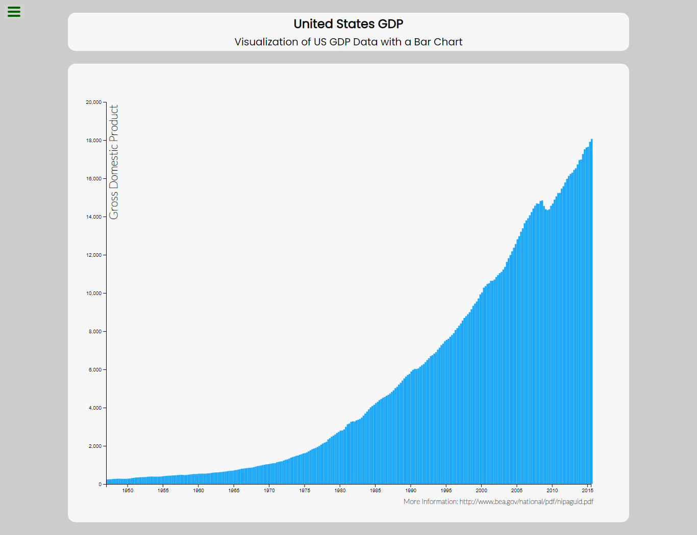
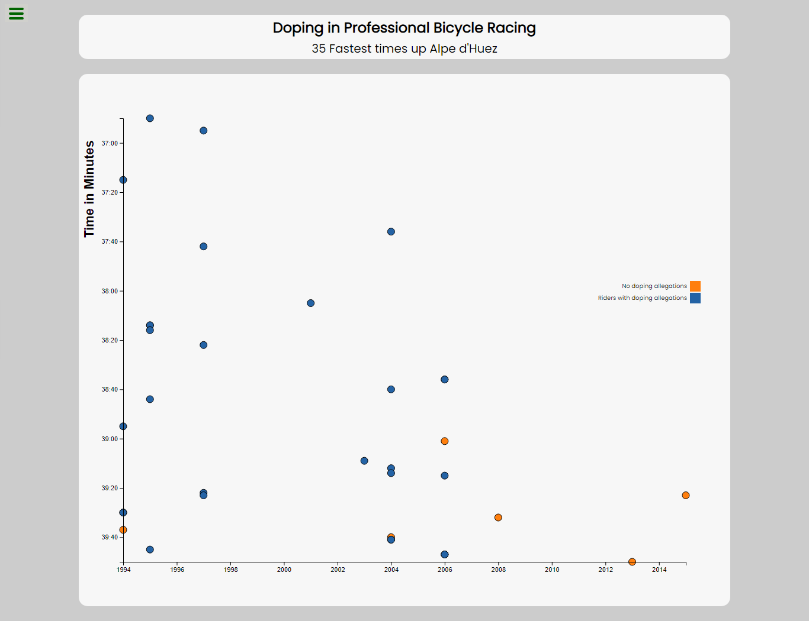
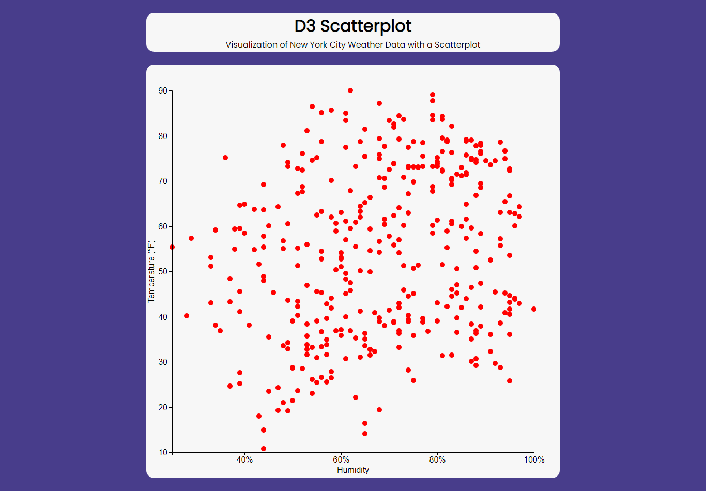
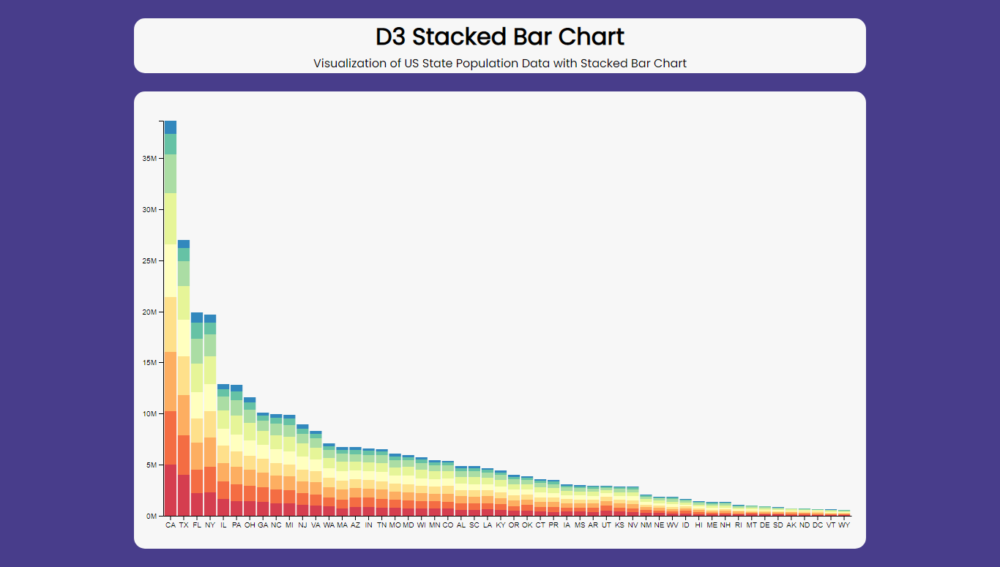
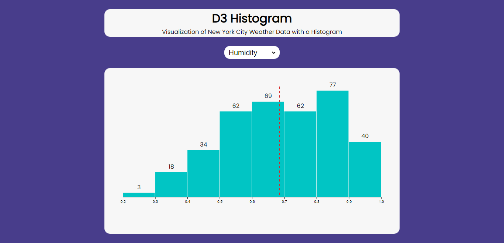
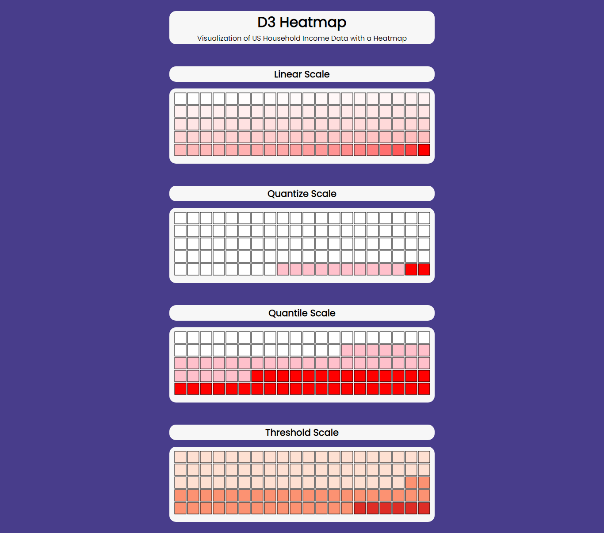
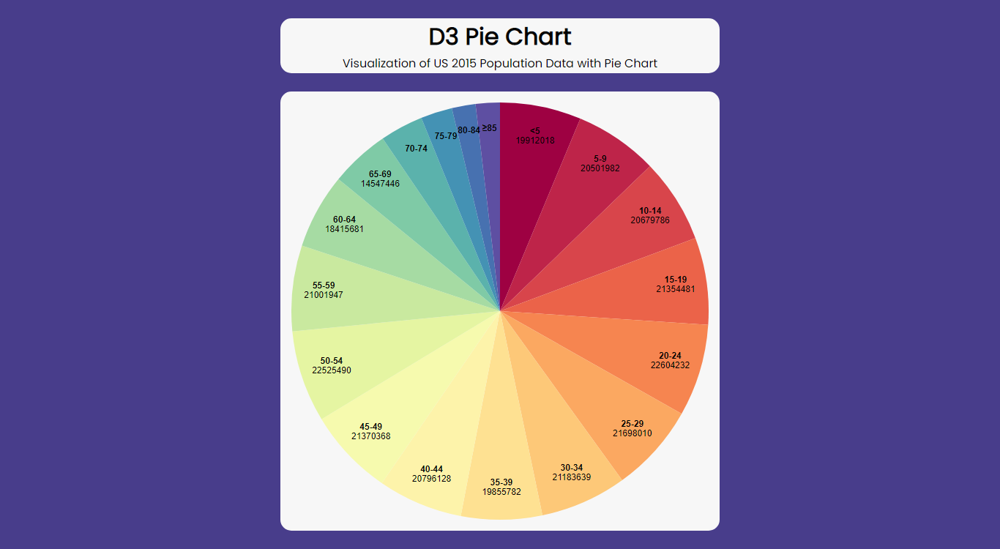
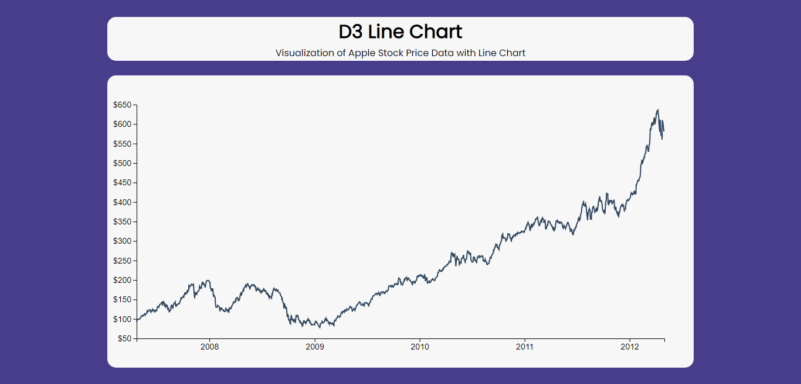
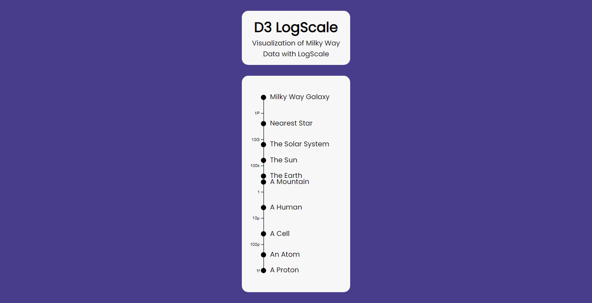

# Data Visualization with D3.js Projects

This repo contains ongoing and/or completed projects related to learning Data Visualization with D3.js. Check each folder above for each chart's code or click on the links below to view the associated GitHub Page

## FreeCodeCamp's Data Visualization Certification

These projects were completed for [freeCodeCamp's Data Visualization Certification Course](https://www.freecodecamp.org/learn/data-visualization/):

1. View Live Site: [Visualization of US GDP Data with a Bar Chart](https://mikeattah.github.io/data-driven-documents/freecodecamp-us-gdp-data-bar-chart/)
   

2. View Live Site: [Visualization of Doping in Professional Bicycle Racing Data with a Scatterplot Graph](https://mikeattah.github.io/data-driven-documents/freecodecamp-doping-in-professional-bicycle-racing-data-scatterplot-graph/)
   

3. View Live Site: [X](https://mikeattah.github.io/data-driven-documents/X/)
   

4. View Live Site: [X](https://mikeattah.github.io/data-driven-documents/X/)
   

5. View Live Site: [X](https://mikeattah.github.io/data-driven-documents/X/)
   

## Educative's Master D3.js for Data Visualization Course

These projects were completed during [Educative's Master D3.js Data Visualization Course](https://www.educative.io/courses/master-d3-data-visualization):

1. View Live Site: [Visualization of New York City Weather Data with a Scatterplot](https://mikeattah.github.io/data-driven-documents/educative-nyc-weather-scatterplot/)
   

2. View Live Site: [Visualization of US State Population Data with Stacked Bar Chart](https://mikeattah.github.io/data-driven-documents/educative-us-state-population-stacked-bar-chart/)
   

3. View Live Site: [Visualization of New York City Weather Data with a Histogram](https://mikeattah.github.io/data-driven-documents/educative-nyc-weather-histogram/)
   

4. View Live Site: [Visualization of US Household Income Data with a Heatmap
   ](https://mikeattah.github.io/data-driven-documents/educative-us-household-income-heatmap/)
   

5. View Live Site: [Visualization of US 2015 Population Data with Pie Chart](https://mikeattah.github.io/data-driven-documents/educative-us-2015-population-pie-chart/)
   

6. View Live Site: [Visualization of Apple Stock Price Data with Line Chart](https://mikeattah.github.io/data-driven-documents/educative-apple-stock-price-line-chart/)
   

7. View Live Site: [Visualization of Milky Way Data with LogScale](https://mikeattah.github.io/data-driven-documents/educative-milky-way-logscale/)
   

## Toolbox

- HTML5
- CSS3
- JavaScript
- D3.js
